[↩ Return](README.md)
# Hardware
* [Logic Gates](#logic-gates)
	+ [Nand](#nand) (2 relays)
	+ [Invert](#invert) (1 nand gate)
	+ [And](#and) (2 nand gates)
	+ [Or](#or) (3 nand gates)
	+ [Xor](#xor) (4 nand gates)
* [Arithmetics](#arithmetics)
	+ [Half Adder](#half-adder) (5 nand gates)
	+ [Full Adder](#full-adder) (9 nand gates)
	+ [Multi-bit Adder](#multi-bit-adder) (18 nand gates)
	+ [Increment](#increment) (145 nand gates)
	+ [Subtraction](#subtraction) (161 nand gates)
	+ [Equal to Zero](#equal-to-zero) (10 nand gates)
	+ [Less than Zero](#less-than-zero)
* [Switching](#switching)
	+ [Selector](#selector) (4 nand gates)
	+ [Switch](#switch) (4 nand gates)
* [Arithmetic Logic Unit](#arithmetic-logic-unit)
	+ [Logic Unit](#logic-unit) (X nand gates)
	+ [Arithmetic Unit](#arithmetic-unit) (X nand gates)
	+ [ALU](#alu)
	+ [Condition](#condition) (X nand gates)
* [Memory](#memory)
	+ [Latch](#latch) (4 nand gates)
	+ [Data Flip-Flop](#data-flip-flop) (10 nand gates)
	+ [Register](#register) (20 nand gates)
	+ [Counter](#counter) (370 nand gates)
	+ [RAM](#ram) (388 nand gates)
* [Processor](#processor)
	+ [Combined Memory](#combined-memory) (240 + 79104 nand gates)
	+ [Instruction](#instruction) (X nand gates)
	+ [Control Unit](#control-unit) (1162 + 79104 nand gates)
	+ [Computer](#computer) (1492 + 79104  nand gates)
	+ [Input and Output](#input-and-output) (66 nand gates)

***

# Logic Gates

---

## Nand

<details><summary>Relay (Default <strong>on</strong>)</summary>

> | x | y | x < y |
> |:-:|:-:|:-----:|
> | 0 | 0 |   0   |
> | 0 | 1 | **1** |
> | 1 | 0 |   0   |
> | 1 | 1 |   0   |


***

> | y | x | y < x |
> |:-:|:-:|:-----:|
> | 0 | 0 |   0   |
> | 1 | 0 |   0   |
> | 0 | 1 | **1** |
> | 1 | 1 |   0   |


***

> | x | 1 |  !x   |
> |:-:|:-:|:-----:|
> | 0 | 1 | **1** |
> | 0 | 1 | **1** |
> | 1 | 1 |   0   |
> | 1 | 1 |   0   |


***

> | y | 1 |  !y   |
> |:-:|:-:|:-----:|
> | 0 | 1 | **1** |
> | 0 | 1 |   0   |
> | 1 | 1 | **1** |
> | 1 | 1 |   0   |


***
</details>
<details><summary>Relay (Default <strong>off</strong>)</summary>

> | x | y | x & y |
> |:-:|:-:|:-----:|
> | 0 | 0 |   0   |
> | 0 | 1 |   0   |
> | 1 | 0 |   0   |
> | 1 | 1 | **1** |


***
</details>

##### Solutions:
- [ ] `!( !y < x )` 

| y | 1 | → | !y | x | → | r < x | 1 | → | !r |
|:-:|:-:|:-:|:--:|:-:|:-:|:-----:|:-:|:-:|:--:|
| 0 | 1 | → | 1  | 0 | → |   0   | 1 | → | 1  |
| 1 | 1 | → | 0  | 0 | → |   0   | 1 | → | 1  |
| 0 | 1 | → | 1  | 1 | → |   0   | 1 | → | 1  |
| 1 | 1 | → | 0  | 1 | → |   1   | 1 | → | 0  |


- [ ] `!( !x < y )`

| x | 1 | → | !x | y | → | r < y | 1 | → | !r |
|:-:|:-:|:-:|:--:|:-:|:-:|:-----:|:-:|:-:|:--:|
| 0 | 1 | → | 1  | 0 | → |   0   | 1 | → | 1  |
| 0 | 1 | → | 1  | 1 | → |   0   | 1 | → | 1  |
| 1 | 1 | → | 0  | 0 | → |   0   | 1 | → | 1  |
| 1 | 1 | → | 0  | 1 | → |   1   | 1 | → | 0  |


- [x] `!( x & y )`

| x | y | → | x & y | 1 | → | !r |
|:-:|:-:|:-:|:-----:|:-:|:-:|:--:|
| 0 | 0 | → |   0   | 1 | → | 1  |
| 0 | 1 | → |   0   | 1 | → | 1  |
| 1 | 0 | → |   0   | 1 | → | 1  |
| 1 | 1 | → |   1   | 1 | → | 0  |


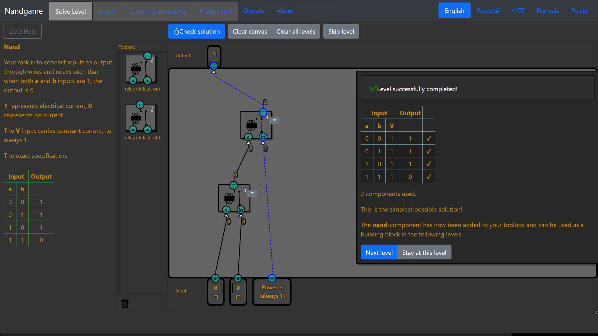

---

## Invert
| x |   out |        |
|:-:|:-----:|:------:|
| 0 | **1** | **!x** |
| 1 |   0   |        |

`not(x)` → `x nand x`


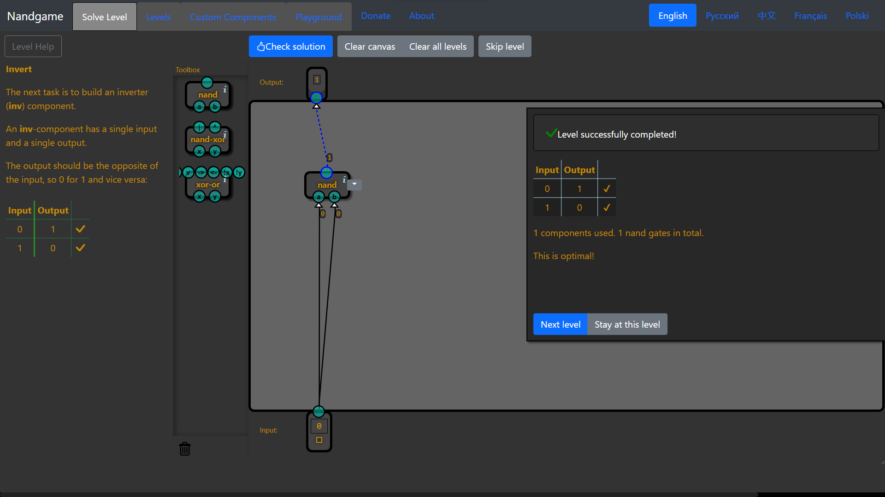

---

## And
| x | y |   out |           |
|:-:|:-:|:-----:|:---------:|
| 0 | 0 |   0   |           |
| 0 | 1 |   0   |           |
| 1 | 0 |   0   |           |
| 1 | 1 | **1** | **x & y** |

`x and y` → `(x nand y) nand (x nand y)` → `inv(x nand y)`


<details><summary><strong>Scheme</strong></summary>


</details>

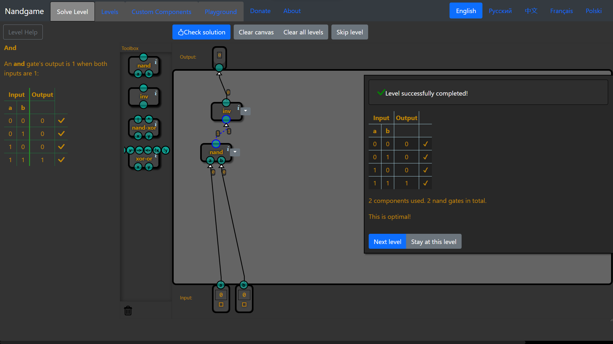

---

## Or
| x | y |   out |             |
|:-:|:-:|:-----:|:-----------:|
| 0 | 0 |   0   |             |
| 0 | 1 | **1** | **!x &  y** |
| 1 | 0 | **1** |  **x & !y** |
| 1 | 1 | **1** |  **x &  y** |

`(not(x) and y) or (x and not(y)) or (x and y)` → `(x nand x) nand (y nand y)` → `inv(x) nand inv(y)`


***

<details><summary>Base gates</summary>


</details>

---

## Xor
| x | y | out |              |
|:-:|:-:|:---:|:------------:|
| 0 | 0 |  0  |              |
| 0 | 1 |  1  | **!x &  y**  |
| 1 | 0 |  1  |  **x & !y**  |
| 1 | 1 |  0  |              |

- [X] Solution #1
`(not(x) and y) or (x and not(y))` → `((x nand y) nand x) nand ((x nand y) nand y)`


<details><summary>The simplest possible solution</summary>


</details>

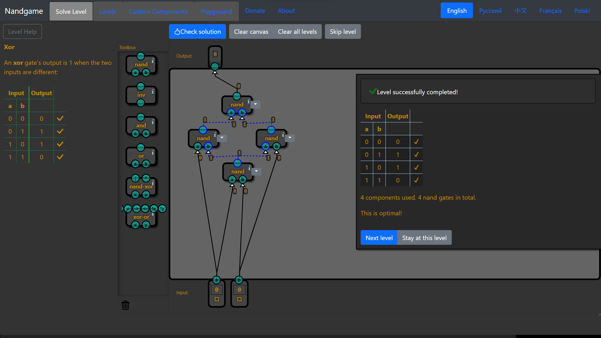


- [ ] Solution #2

| x | y |   | x ^ y | x \| y|   | r1 & r2 |
|:-:|:-:|:-:|:-----:|:-----:|:-:|:-------:|
| 0 | 0 | → |   0   |   1   | → |    0    |
| 0 | 1 | → |   1   |   1   | → |    1    |
| 1 | 0 | → |   1   |   1   | → |    1    |
| 1 | 1 | → |   1   |   0   | → |    0    |

`(x nand y) and (x or y)`
<details><summary>Scheme</summary>


</details>


***

### ***Full True Table***


***

# Arithmetics

---

## Half Adder
| a | b | |   h   |   l   | |    high   |    low     |
|:-:|:-:|-|:-----:|:-----:|-|:---------:|:----------:|
| 0 | 0 |→|   0   |   0   |→|           |            |
| 0 | 1 |→|   0   | **1** |→|           | **!a & b** |
| 1 | 0 |→|   0   | **1** |→|           | **a & !b** |
| 1 | 1 |→| **1** |   0   |→| **a & b** |            |

```
h = a and b
```
```
l = a xor b
```


---

## Full Adder
| a | b | c | |  high |   low | |       high        |       low         |
|:-:|:-:|:-:|-|:-----:|:-----:|-|:-----------------:|:-----------------:|
| 0 | 0 | 0 |→|   0   | **1** |→|                   | **!a & !b & !c**  |
| 0 | 0 | 1 |→|   0   | **1** |→|                   | **!a & !b &  c**  |
| 0 | 1 | 0 |→|   0   | **1** |→|                   | **!a &  b & !c**  |
| 0 | 1 | 1 |→| **1** |   0   |→| **!a &  b &  c**  |                   |
| 1 | 0 | 0 |→|   0   | **1** |→|                   |  **a & !b & !c**  |
| 1 | 0 | 1 |→| **1** |   0   |→|  **a & !b &  c**  |                   |
| 1 | 1 | 0 |→| **1** |   0   |→|  **a &  b & !c**  |                   |
| 1 | 1 | 1 |→| **1** | **1** |→|  **a &  b &  c**  |  **a &  b &  c**  |

```
h = (not(a) and b and c) or (a and not(b) and c) or (a and b and not(c)) or (a and b and c)
```
```
l = (not(a) and not(b) and not(c)) or (not(a) and not(b) and c) or (not(a) and b and not(c)) or (a and not(b) and not(c)) or (a and b and c)
```


---

## Multi-bit Adder


---

## Increment
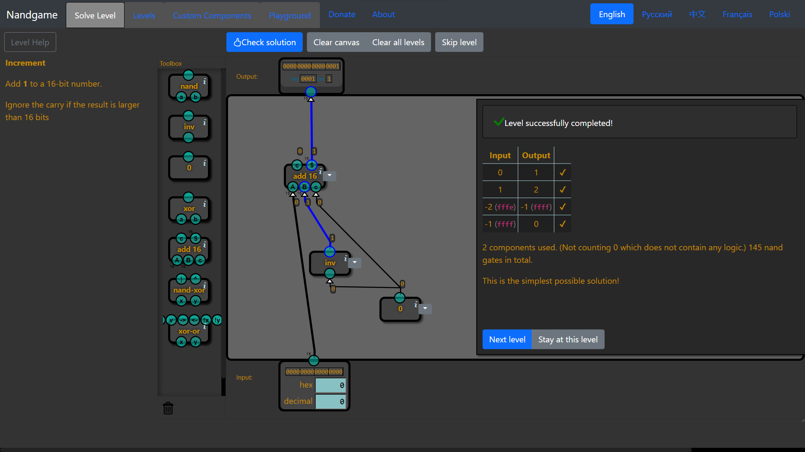

---

## Subtraction
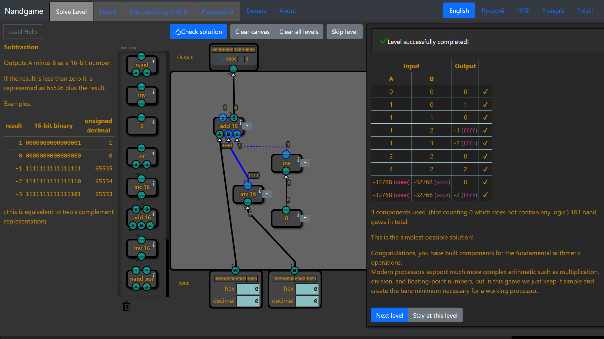

---

## Equal to Zero
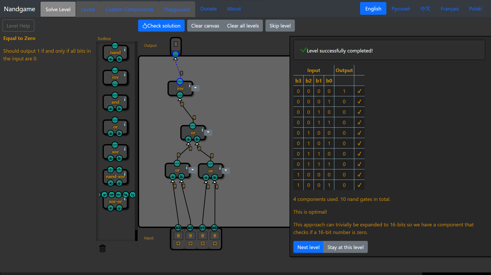

---

## Less than Zero


---

# Switching

---

## Selector
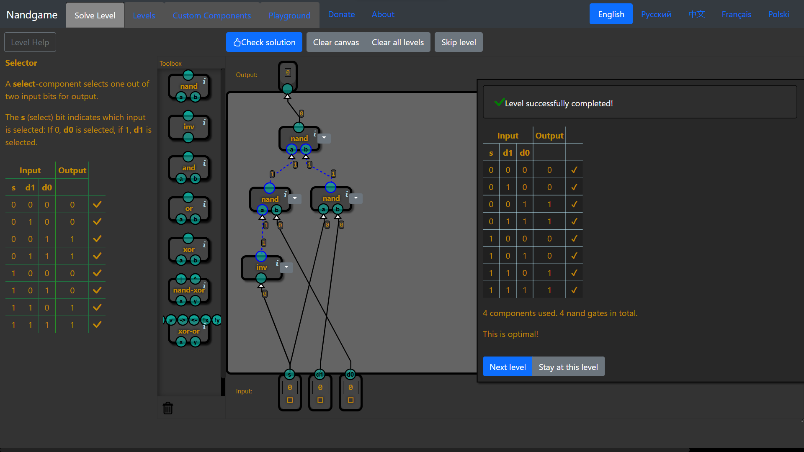

---

## Switch


---

# Arithmetic Logic Unit

---

## Logic Unit


---

## Arithmetic Unit


---

## ALU


---

## Condition


---

# Memory

---

## Latch


---

## Data Flip-Flop
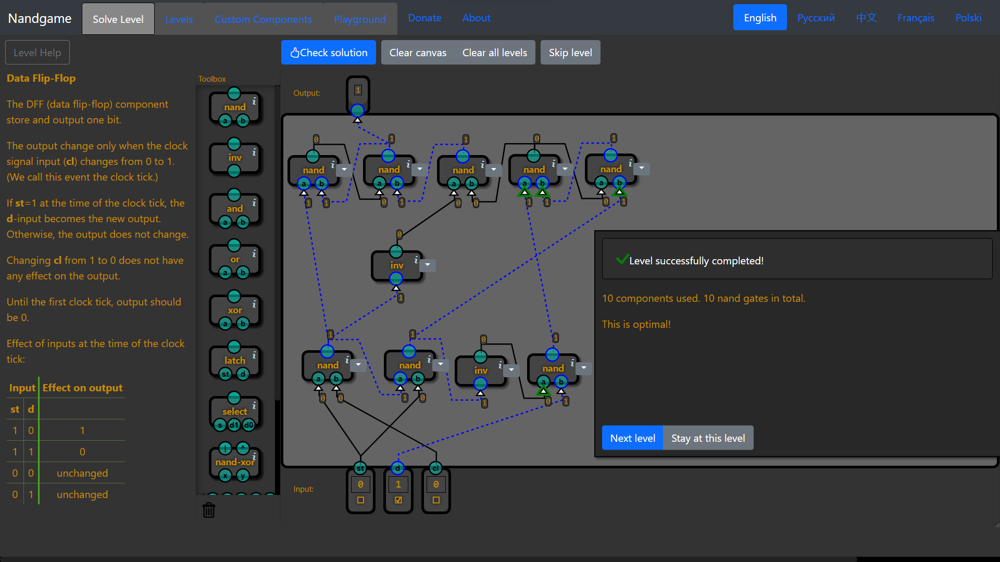

---

## Register


---

## Counter


---

## RAM
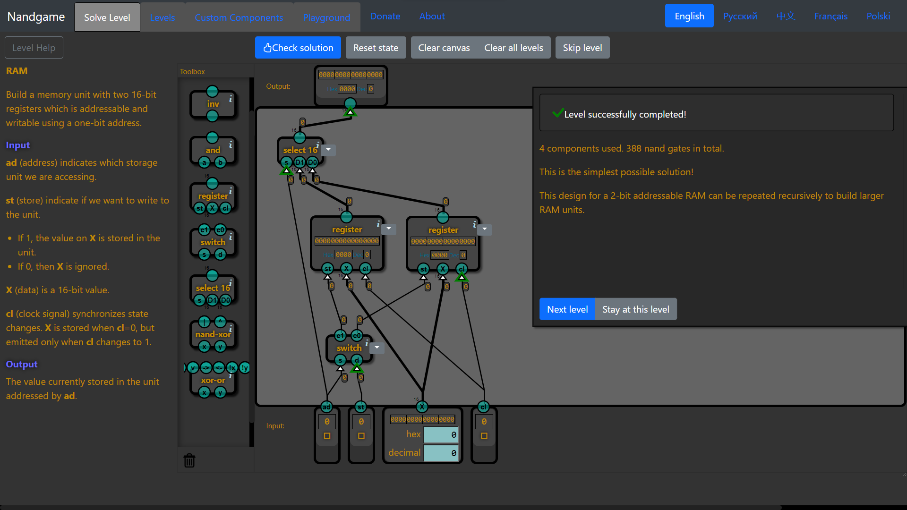

---

# Processor

---

## Combined Memory
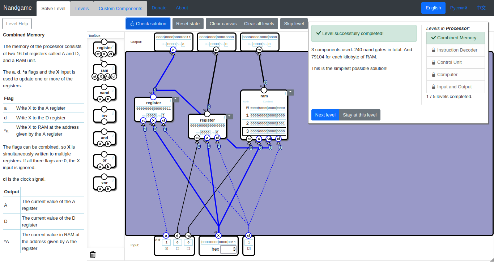

---

## Instruction


---

## Control Unit


---

## Computer


---

## Input and Output


