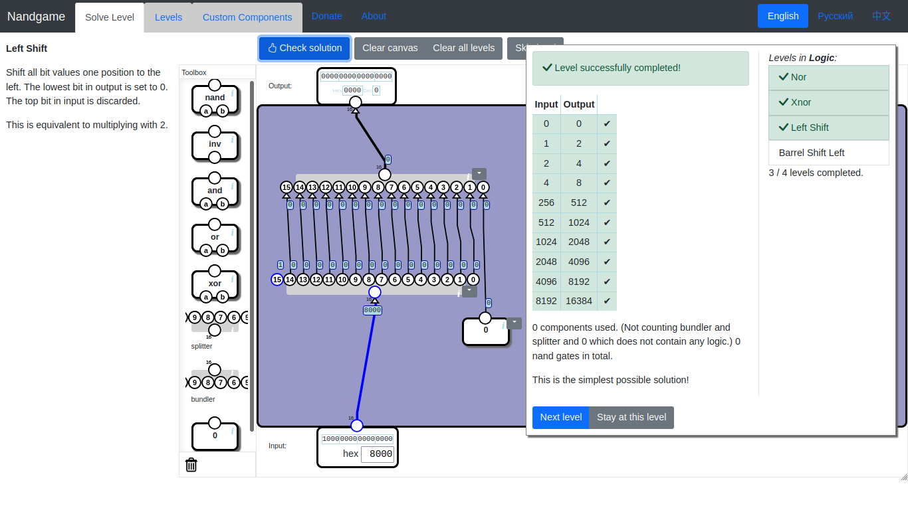
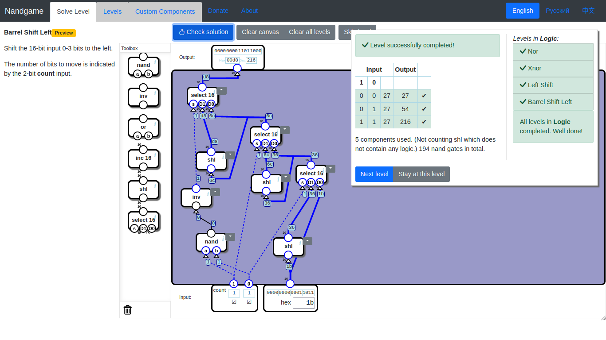

[↩ Return](README.md)
# Optional Levels
* [Transistor level](#transistor-level)
	+ [Nand (CMOS)](#nand-cmos)
	+ ~~[Invert (CMOS)](#invert-cmos)~~
	+ ~~[Nor (CMOS)](#nor-cmos)~~
* [Logic](#logic)
	+ [Xnor](#xnor) (5 nand gates)
	+ [Left Shift](#left-shift)
	+ [Logical Right Shift](#logical-right-shift)
	+ [Artithmetic Right Shift](#artithmetic-right-shift)
	+ [Barrel Shift Left](#barrel-shift-left) (194 nand gates)
* [Arithmetics](#arithmetics)
	+ [Max](#max) (225 nand gates)
	+ [Multiplication](#multiplication) (1520 nand gates)
* [Floating point](#floating-point)
	+ [Unpack floating-point value](#unpack-floating-point-value) (47 nand gates)
	+ [Floating-point multiplication](#floating-point-multiplication) (661 nand gates)
	+ [Normalize overflow](#normalize-overflow) (517 nand gates)
	+ [Verify exponent](#verify-exponent) (111 nand gates)
	+ [Align significands](#align-significands) (547 nand gates)
	+ [Add signed magnitude](#add-signed-magnitude) (610 nand gates)
	+ ~~[Normalize underflow](#normalize-underflow)~~
	+ ~~[Pack floating-point value](#pack-floating-point-value)~~
	+ ~~[Floating-point multiplication](#floating-point-multiplication)~~
	+ ~~[Floating-point addition](#floating-point-addition)~~
* [Multitasking](#multitasking) `preview`
	+ [Timer Trigger](#timer-trigger) `preview`
	+ [Mode controller](#mode-controller) `preview`
	+ [Register with backup](#register-with-backup) `preview`
	+ [Program Counter](#program-counter) `preview`
	+ [Register bank](#register-bank) `preview`
	+ [General-purpose Memory](#general-purpose-memory) `preview`
	+ [Virtual Memory](#virtual-memory) `preview`
	+ [Control Unit](#control-unit) `preview`
	+ [Processor](#processor) `preview`

# Transistor level

## Nand (CMOS)

## Invert (CMOS)
_~ not ready yet ~_

## Nor (CMOS)
_~ not ready yet ~_

# Logic

## Xnor

## Left Shift

## Logical Right Shift
_~ not ready yet ~_
## Artithmetic Right Shift
_~ not ready yet ~_

## Barrel Shift Left

# Arithmetics

## Max

## Multiplication

# Floating point

## Unpack float

## Floating-point multiplication

## Normalize overflow

## Verify exponent

## Align significands

## Add signed magnitude

## Normalize underflow
_~ not ready yet ~_

## Pack float
_~ not ready yet ~_

## Floating-point multiplication
_~ not ready yet ~_

## Floating-point addition
_~ not ready yet ~_

