# Best solutions for [nandgame.com](http://nandgame.com/)

## Hardware
* [Logic Gates](#logic-gates)
	+ [Nand](#nand) (2 relays)
	+ [Invert](#invert) (1 nand gate)
	+ [And](#and) (2 nand gates)
	+ [Or](#or) (3 nand gates)
	+ [Xor](#xor) (4 nand gates)
* [Arithmetics](#arithmetics)
	+ [Half Adder](#half-adder) (5 nand gates)
	+ [Full Adder](#full-adder) (9 nand gates)
	+ [Multi-bit Adder](#multi-bit-adder) (18 nand gates)
	+ [Increment](#increment) (145 nand gates)
	+ [Subtraction](#subtraction) (161 nand gates)
	+ [Equal to Zero](#equal-to-zero) (10 nand gates)
	+ [Less than Zero](#less-than-zero)
* [Plumbing](#plumbing)
	+ [Selector](#selector) (4 nand gates)
	+ [Switch](#switch) (5 nand gates)
* [Memory](#memory)
	+ [Latch](#latch) (4 nand gates)
	+ [Data Flip-Flop](#data-flip-flop) (9 nand gates)
	+ [Register](#register) (15 nand gates)
	+ [Counter](#counter) (330 nand gates)
	+ [RAM](#ram) (309 nand gates)
* [Arithmetic Logic Unit](#arithmetic-logic-unit)
	+ [Unary ALU](#unary-alu) (144 nand gates)
	+ [ALU](#alu) (608 nand gates)
	+ [Opcodes](#opcodes)
	+ [Condition](#condition) (56 nand gates)
* [Processor](#processor)
	+ [Combined Memory](#combined-memory) (240 + 79104 nand gates)
	+ [Instruction Decoder](#instruction-decoder) (130 nand gates)
	+ [Control Unit](#control-unit) (1162 + 79104 nand gates)
	+ [Computer](#computer) (1492 + 79104  nand gates)
	+ [Input and Output](#input-and-output) (66 nand gates)
## Software
* [Programming](#programming)
	+ [Machine code](#machine-code)
	+ [Assembler](#assembler)
	+ [Escape Labyrinth](#escape-labyrinth)
	+ [Display](#display)
* [Stack machine](#stack-machine)
	+ [Init stack](#init-stack)
	+ [Push D](#push-d)
	+ [Pop D](#pop-d), [Pop A](#pop-a)
	+ [Push Value](#push-value)
	+ [Add](#add), [Sub](#sub), [Neg](#neg)
	+ [Tokenize](#tokenize)
	+ [Grammar](#grammar)
	+ [Code generation](#code-generation)
* [Conditionals](#conditionals)
	+ [Eq](#eq)
	+ [Gt](#gt)
	+ [Lt](#lt)
	+ [Not](#not)
	+ [Goto](#goto)
	+ [If-goto](#if-goto)
## Optional Levels
* [Transistor level](#transistor-level)
	+ [Nand (CMOS)](#nand-cmos)
	+ [Invert (CMOS)](#invert-cmos)
	+ [Nor (CMOS)](#nor-cmos)
* [Logic](#logic)
	+ [Xnor](#xnor) (5 nand gates)
	+ [Left Shift](#left-shift)
	+ [Barrel Shift Left](#barrel-shift-left) `preview` (194 nand gates)
* [Arithmetics](#arithmetics)
	+ [Max](#max) (225 nand gates)
	+ [Multiplication](#multiplication) (1520 nand gates)
* [Floating point](#floating-point)
	+ [Unpack float](#unpack-float) `preview` (47 nand gates)
	+ [Floating-point multiplication](#floating-point-multiplication) `preview` (661 nand gates)
	+ [Normalize overflow](#normalize-overflow) `preview` (517 nand gates)
	+ [Verify exponent](#verify-exponent) `preview` (111 nand gates)
	+ [Align significands](#align-significands) `preview` (547 nand gates)
	+ [Add signed magnitude](#add-signed-magnitude) `preview` (610 nand gates)
	+ [Normalize underflow](#normalize-underflow) `preview`
	+ [Pack float](#pack-float) `preview`
	+ [Floating point multiplication](#floating-point-multiplication-1) `preview`
	+ [Floating-point addition](#floating-point-addition) `preview`


# Logic Gates
## Nand
| x | y | out |
|:-:|:-:|:---:|
| 0 | 0 |  1  |
| 0 | 1 |  1  |
| 1 | 0 |  1  |
| 1 | 1 |  0  |

`(not(x) and not(y)) or (not(x) and y) or (x and not(y))`

`(not(x) and (not(y) or y)) or (x and not(y))`

`(not(x)) or (x and not(y))`

`not(x and y)` -> `x nand y`


## Invert
| x | out |
|:-:|:---:|
| 0 |  1  |
| 1 |  0  |

`not(x)` -> `x nand x`


## And
| x | y | out |
|:-:|:-:|:---:|
| 0 | 0 |  0  |
| 0 | 1 |  0  |
| 1 | 0 |  0  |
| 1 | 1 |  1  |

`x and y` -> `not(x nand y)`


## Or
| x | y | out |
|:-:|:-:|:---:|
| 0 | 0 |  0  |
| 0 | 1 |  1  |
| 1 | 0 |  1  |
| 1 | 1 |  1  |

`(not(x) and y) or (x and not(y)) or (x and y)`

`(y and (not(x) or not(y))) or (x and y)`

`(y and not(x and y)) or (x and y)`

`x or y` -> `not(x) nand not(y)`


## Xor
| x | y | out |
|:-:|:-:|:---:|
| 0 | 0 |  0  |
| 0 | 1 |  1  |
| 1 | 0 |  1  |
| 1 | 1 |  0  |

```
(not(x) and y) or (x and not(y))
```

```
x xor y` -> `(not(x) nand y) nand (not(y) nand x)` -> `((x nand y) nand x) nand ((x nand y) nand y)
```


# Arithmetics
## Half Adder
| a | b | h | l |
|:-:|:-:|:-:|:-:|
| 0 | 0 | 0 | 0 |
| 0 | 1 | 0 | 1 |
| 1 | 0 | 0 | 1 |
| 1 | 1 | 1 | 0 |

```
x and y = h
```

```
(not(a) and b) or (a and not(b)) = l
```


## Full Adder
| a | b | c | h | l |
|:-:|:-:|:-:|:-:|:-:|
| 0 | 0 | 0 | 0 | 1 |
| 0 | 0 | 1 | 0 | 1 |
| 0 | 1 | 0 | 0 | 1 |
| 0 | 1 | 1 | 1 | 0 |
| 1 | 0 | 0 | 0 | 1 |
| 1 | 0 | 1 | 1 | 0 |
| 1 | 1 | 0 | 1 | 0 |
| 1 | 1 | 1 | 1 | 1 |

```
(not(a) and b and c) or (a and not(b) and c) or (a and b and not(c)) or (a and b and c) = h
```

```
(not(a) and not(b) and not(c)) or (not(a) and not(b) and c) or (not(a) and b and not(c)) or (a and not(b) and not(c)) or (a and b and c) = l
```


## Multi-bit Adder


## Increment


## Subtraction


## Equal to Zero


## Less than Zero


# Plumbing
## Selector
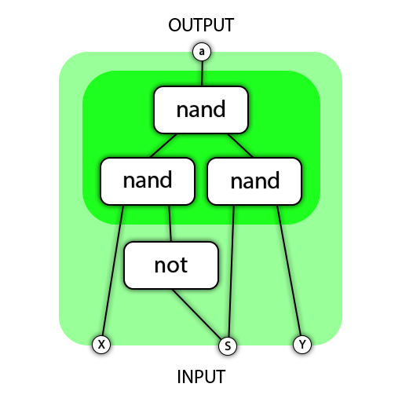


## Switch
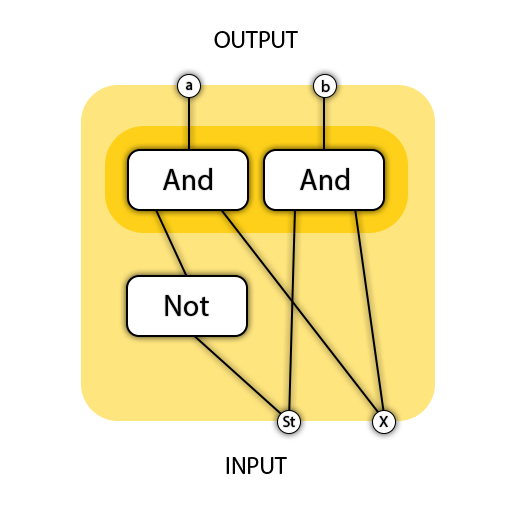


# Memory
## Latch


## Data Flip-Flop
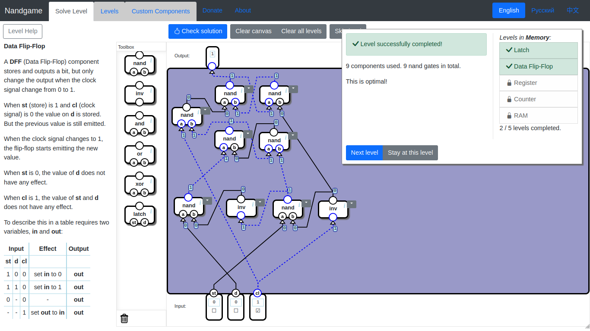


## Register


## Counter


## RAM


# Arithmetic Logic Unit
## Unary ALU


## ALU


## Opcodes
| Opcode | zx | nx | zy | ny | f | no |
| :----: |:--:|:--:|:--:|:--:|:-:|:--:|
| X      | 0  | 0  | 1  | 0  | 1 | 0  |
| Y      | 1  | 0  | 0  | 0  | 1 | 0  |
| X & Y  | 0  | 0  | 0  | 0  | 0 | 0  |
| X \| Y | 0  | 1  | 0  | 1  | 0 | 1  |
| ~X     | 0  | 1  | 1  | 0  | 1 | 0  |
| ~Y     | 1  | 0  | 0  | 1  | 1 | 0  |
| X + Y  | 0  | 0  | 0  | 0  | 1 | 0  |
| X - Y  | 0  | 1  | 0  | 0  | 1 | 1  |
| Y - X  | 0  | 0  | 0  | 1  | 1 | 1  |
| 0      | 1  | 0  | 1  | 0  | 0 | 0  |
| -1     | 1  | 1  | 1  | 0  | 1 | 0  |
| 1      | 1  | 1  | 1  | 1  | 1 | 1  |
| -X     | 0  | 0  | 1  | 1  | 1 | 1  |
| -Y     | 1  | 1  | 0  | 0  | 1 | 1  |
| X + 1  | 0  | 1  | 1  | 1  | 1 | 1  |
| Y + 1  | 1  | 1  | 0  | 1  | 1 | 1  |
| X - 1  | 0  | 0  | 1  | 1  | 1 | 0  |
| Y - 1  | 1  | 1  | 0  | 0  | 1 | 0  |


## Condition


# Processor
## Combined Memory


## Instruction Decoder


## Control Unit


## Computer


## Input and Output


# Programming
## Machine code
| ci |   |   | sm | zx | nx | zy | ny | f | no | a | d | \*a | lt | eq | gt |
|:--:|:-:|:-:|:--:|:--:|:--:|:--:|:--:|:-:|:--:|:-:|:-:|:---:|:--:|:--:|:--:|
| 1  | 0 | 0 | 0  | 1  | 0  | 1  | 0  | 1 | 0  | 0 | 1 | 0   | 0  | 0  | 0  |
| 0  | 0 | 0 | 0  | 0  | 0  | 0  | 0  | 0 | 0  | 0 | 0 | 0   | 0  | 1  | 0  |
| 1  | 0 | 0 | 0  | 0  | 1  | 1  | 1  | 1 | 1  | 0 | 1 | 0   | 0  | 0  | 0  |
| 1  | 0 | 0 | 0  | 0  | 0  | 0  | 0  | 0 | 0  | 0 | 0 | 0   | 1  | 1  | 1  |


## Assembler
```asm
# Assembler code 
loop:
A = 0x7FFF
*A = *A+1
*A = *A+1
A = loop
JMP
```


## Escape Labyrinth
```asm
begin:
A = 0x7FFF
D = *A
A = 255
D = D - A
A = begin
D - 1; JGT
A = 0x7FFF
D = *A
A = 255
D = D - A
A = tl
D - 1; JEQ
fw:
A = 4
D = A
A = 0x7FFF
*A = D + *A
A = begin
JMP
tl:
A = 8
D = A
A = 0x7FFF
*A = D + *A
A = begin
JMP
```


## Display

# Stack machine

## Init stack
```asm
A = 0x0100
D = A
A = SP
*A = D
```

## Push D
```asm
A = SP
A = *A
*A = D
A = SP
*A = *A+1
```

## Pop D
```asm
A = SP
*A = *A-1
A = *A
D = *A
```

## Pop A
```asm
A = SP
*A = *A-1
A = *A
A = *A
```

## Push Value
```asm
A = value
D = A
PUSH_D
```

## Add
```asm
POP_D
POP_A
D = D + A
PUSH_D
```

## Sub
```asm
POP_D
POP_A
D = A - D
PUSH_D
```

## Neg
```asm
POP_A
D = -A
PUSH_D
```

## Tokenize
| Type    | Match  | Grammar | Name   |
|:-------:|:------:|:-------:|:------:|
| Pattern | [ ]+   | Ignore  |        |
| Pattern | [0-9]+ | Name    | Number |
| Exact   | +      | Literal |        |
| Exact   | -      | Literal |        |
| Exact   | (      | Literal |        |
| Exact   | )      | Literal |        |

## Grammar
| Symbol     | Expression          |
|:----------:|:-------------------:|
| PROGRAM    | Expression          |
| Expression | Expression + Number |
| Expression | Number              |
| Expression | Expression - Number |
| Expression | ( Expression )      |
| Expression | Number - Expression |
| Expression | Number + Expression |
| Expression | - Expression        |

## Code generation
`PROGRAM` `Expression`
```asm

```

`Expression` `Expression + Number`
```asm
%Expression%
PUSH_VALUE %Number%
ADD
```

`Expression` `Number`
```asm
PUSH_VALUE %Number%
```

`Expression` `Expression - Number`
```asm
%Expression%
PUSH_VALUE %Number%
SUB
```

`Expression` `( Expression )`
```asm
%Expression%
```

`Expression` `Number - Expression`
```asm
PUSH_VALUE %Number%
%Expression%
SUB
```

`Expression` `Number + Expression`
```asm
PUSH_VALUE %Number%
%Expression%
ADD
```

`Expression` `- Expression`
```asm
%Expression%
NEG
```

# Conditionals

## Eq

## Gt

## Lt

## Not

## Goto

## If-goto

# Transistor level

## Nand (CMOS)
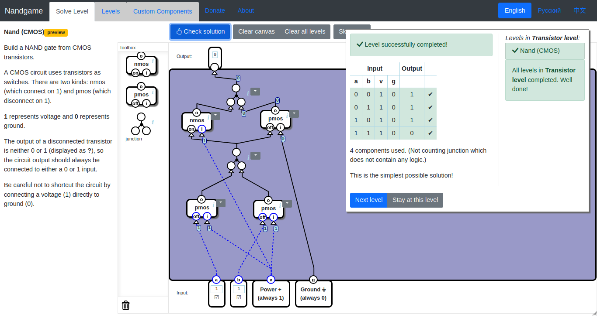

## Invert (CMOS)

## Nor (CMOS)

# Logic

## Xnor
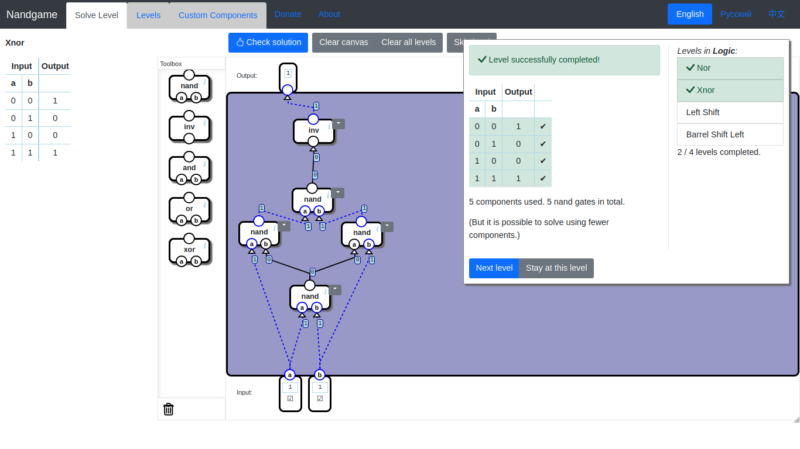

## Left Shift
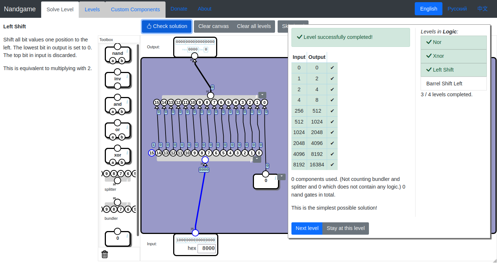

## Barrel Shift Left
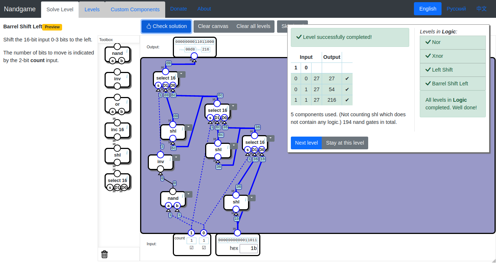

# Arithmetics

## Max
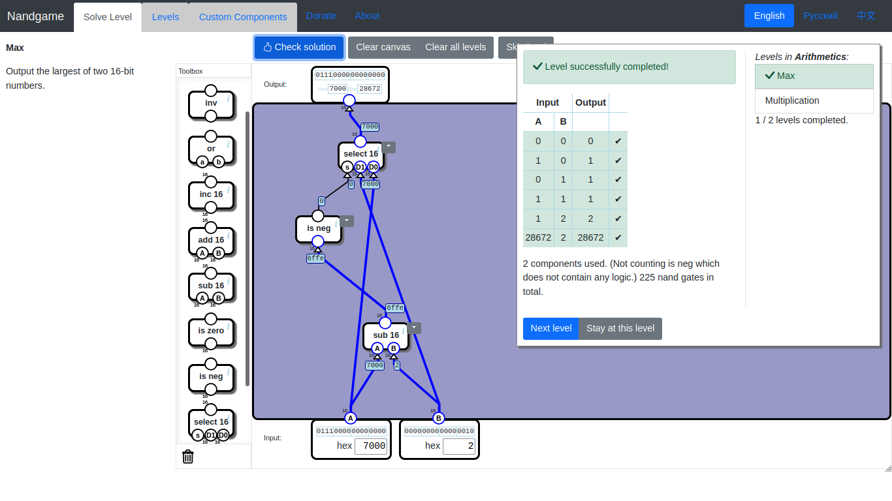

## Multiplication
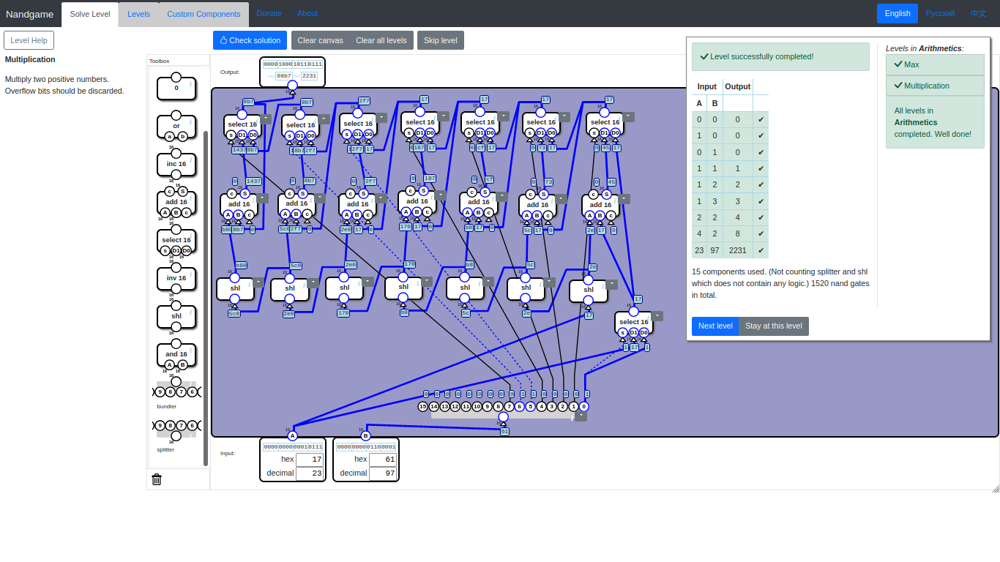

# Floating point

## Unpack float
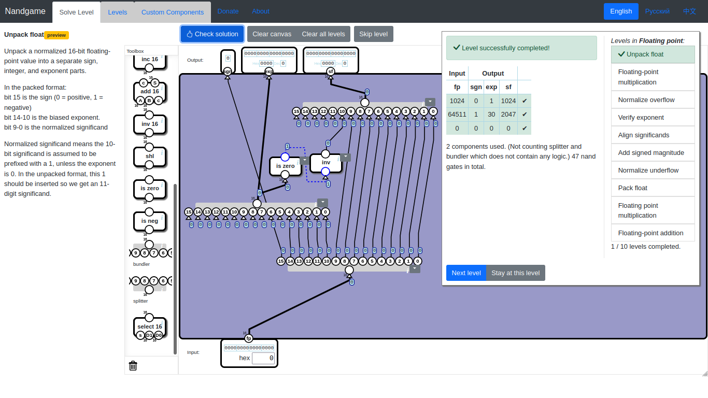

## Floating-point multiplication
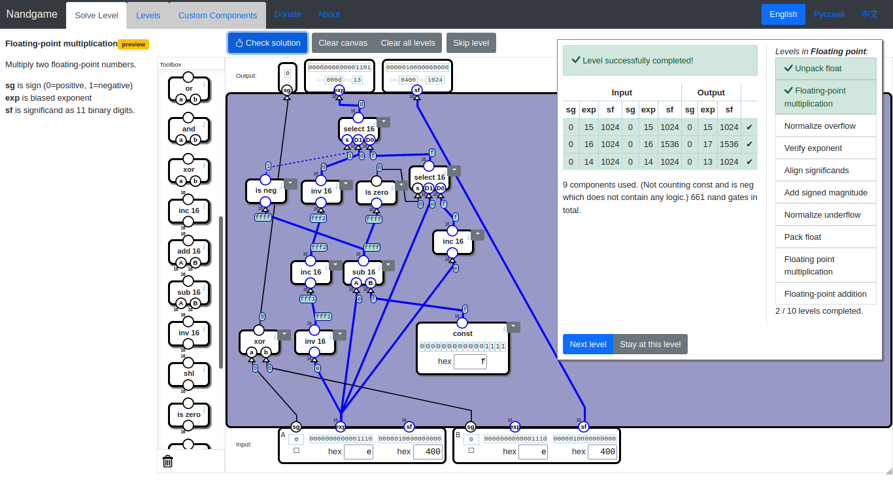

## Normalize overflow
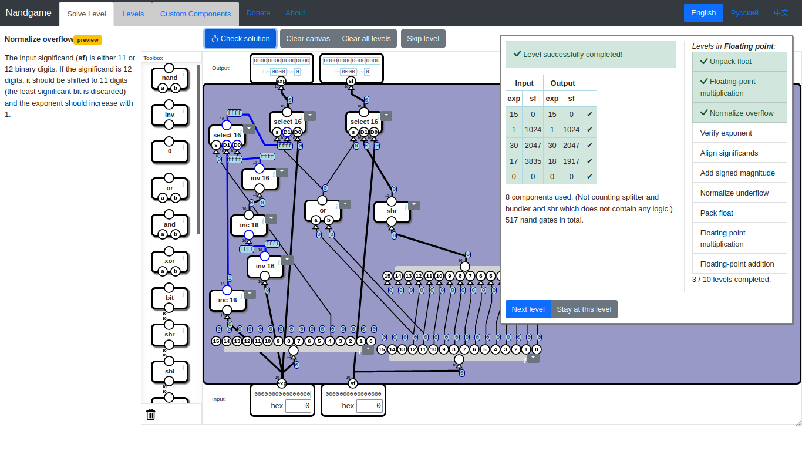

## Verify exponent
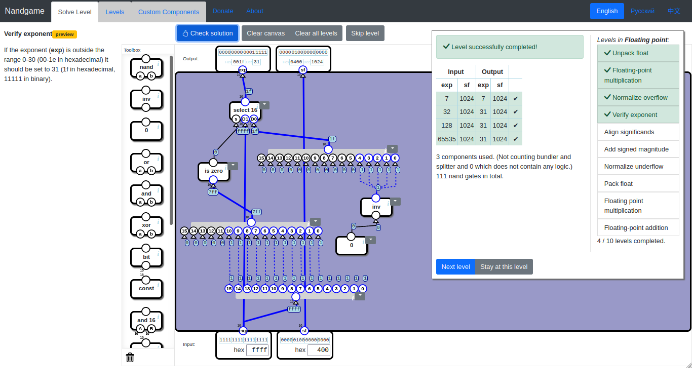

## Align significands
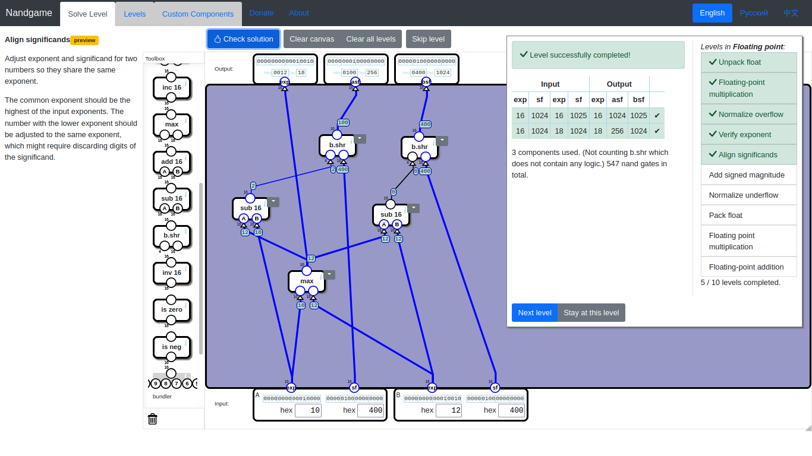

## Add signed magnitude
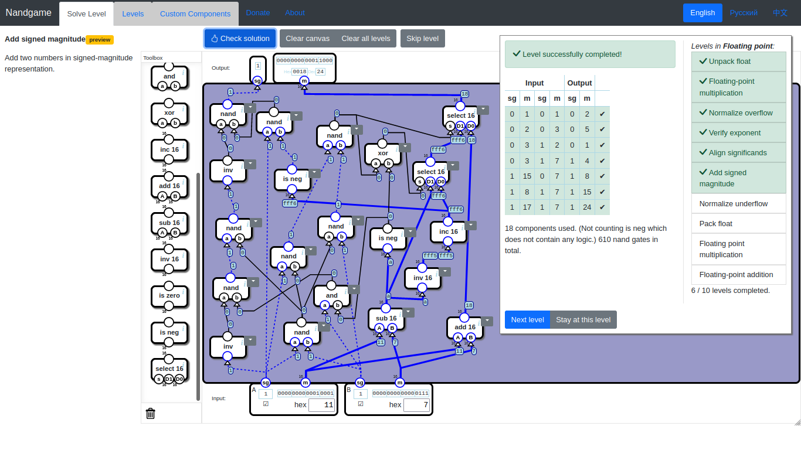

## Normalize underflow

## Pack float

## Floating-point multiplication

## Floating-point addition


