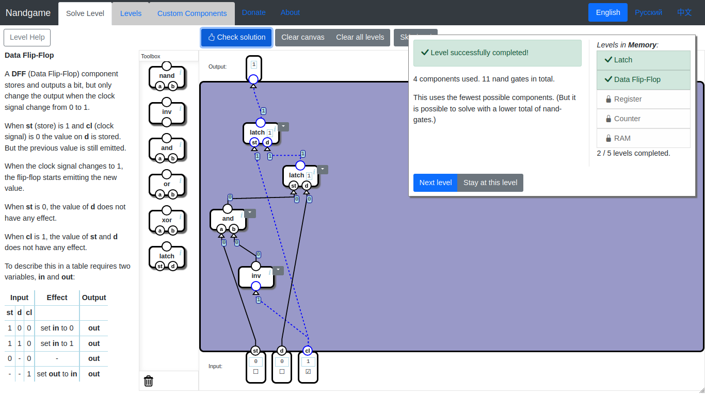
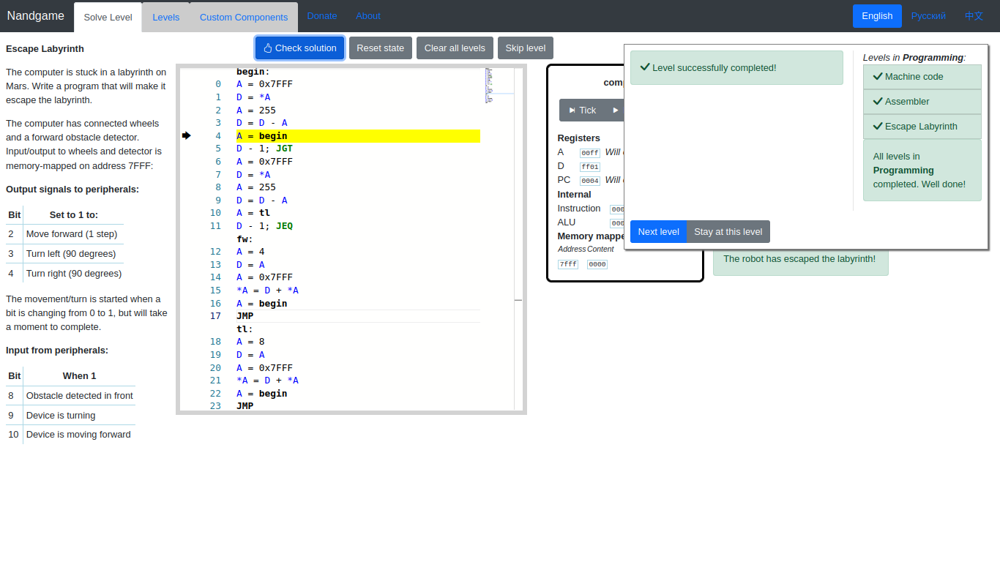

# Best solutions for [nandgame.com](http://nandgame.com/)

* [Logic Gates](#logic-gates)
	+ [Nand](#nand) (1 relay)
	+ [Invert](#invert) (1 nand gate)
	+ [And](#and) (2 nand gates)
	+ [Or](#or) (3 nand gates)
	+ [Xor](#xor) (4 nand gates)
* [Arithmetics](#arithmetics)
	+ [Half Adder](#half-adder) (5 nand gates)
	+ [Full Adder](#full-adder) (9 nand gates)
	+ [Multi-bit Adder](#multi-bit-adder) (18 nand gates)
	+ [Increment](#increment) (145 nand gates)
	+ [Subtraction](#subtraction) (161 nand gates)
	+ [Equal to Zero](#equal-to-zero) (10 nand gates)
	+ [Less than Zero](#less-than-zero)
* [Plumbing](#plumbing)
	+ [Selector](#selector) (4 nand gates)
	+ [Switch](#switch) (5 nand gates)
* [Memory](#memory)
	+ [Latch](#latch) (4 nand gates)
	+ [Data Flip-Flop](#data-flip-flop) (9 nand gates)
	+ [Register](#register) (15 nand gates)
	+ [Counter](#counter) (607 nand gates)
	+ [RAM](#ram) (309 nand gates)
* [Arithmetic Logic Unit](#arithmetic-logic-unit)
	+ [Unary ALU](#unary-alu) (144 nand gates)
	+ [ALU](#alu) (608 nand gates)
	+ [Opcodes](#opcodes)
	+ [Condition](#condition) (56 nand gates)
* [Processor](#processor)
	+ [Combined Memory](#combined-memory) (240 + 79104 nand gates)
	+ [Instruction Decoder](#instruction-decoder) (130 nand gates)
	+ [Control Unit](#control-unit) (1162 + 79104 nand gates)
	+ [Computer](#computer) (1769 + 79104  nand gates)
	+ [Input and Output](#input-and-output) (66 nand gates)
* [Programming](#programming)
	+ [Machine code](#machine-code), [Assembler](#assembler), [Escape Labyrinth](#escape-labyrinth)


# Logic Gates
## Nand
`!(x & y)`


## Invert
`!x`


## And
`x & y`


## Or
`x | y`


## Xor
`x ^ y`


# Arithmetics
## Half Adder


## Full Adder


## Multi-bit Adder


## Increment


## Subtraction


## Equal to Zero


## Less than Zero


# Plumbing
## Selector


## Switch


# Memory
## Latch


## Data Flip-Flop


## Register


## Counter


## RAM


# Arithmetic Logic Unit
## Unary ALU


## ALU


## Opcodes
| Opcode | zx | nx | zy | ny | f | no |
| :----: |:--:|:--:|:--:|:--:|:-:|:--:|
| X      | 0  | 0  | 1  | 0  | 1 | 0  |
| Y      | 1  | 0  | 0  | 0  | 1 | 0  |
| X & Y  | 0  | 0  | 0  | 0  | 0 | 0  |
| X | Y  | 0  | 1  | 0  | 1  | 0 | 1  |
| ~X     | 0  | 1  | 1  | 0  | 1 | 0  |
| ~Y     | 1  | 0  | 0  | 1  | 1 | 0  |
| X + Y  | 0  | 0  | 0  | 0  | 1 | 0  |
| X - Y  | 0  | 1  | 0  | 0  | 1 | 1  |
| Y - X  | 0  | 0  | 0  | 1  | 1 | 1  |
| 0      | 1  | 0  | 1  | 0  | 0 | 0  |
| -1     | 1  | 1  | 1  | 0  | 1 | 0  |
| 1      | 1  | 1  | 1  | 1  | 1 | 1  |
| -X     | 0  | 0  | 1  | 1  | 1 | 1  |
| -Y     | 1  | 1  | 0  | 0  | 1 | 1  |
| X + 1  | 0  | 1  | 1  | 1  | 1 | 1  |
| Y + 1  | 1  | 1  | 0  | 1  | 1 | 1  |
| X - 1  | 0  | 0  | 1  | 1  | 1 | 0  |
| Y - 1  | 1  | 1  | 0  | 0  | 1 | 0  |


## Condition


# Processor
## Combined Memory


## Instruction Decoder


## Control Unit


## Computer


## Input and Output


# Programming
## Machine code
| ci |   |   | sm | zx | nx | zy | ny | f | no | a | d | \*a | lt | eq | gt |
|:--:|:-:|:-:|:--:|:--:|:--:|:--:|:--:|:-:|:--:|:-:|:-:|:---:|:--:|:--:|:--:|
| 1  | 0 | 0 | 0  | 1  | 0  | 1  | 0  | 1 | 0  | 0 | 1 | 0   | 0  | 0  | 0  |
| 0  | 0 | 0 | 0  | 0  | 0  | 0  | 0  | 0 | 0  | 0 | 0 | 0   | 0  | 1  | 0  |
| 1  | 0 | 0 | 0  | 0  | 1  | 1  | 1  | 1 | 1  | 0 | 1 | 0   | 0  | 0  | 0  |
| 1  | 0 | 0 | 0  | 0  | 0  | 0  | 0  | 0 | 0  | 0 | 0 | 0   | 1  | 1  | 1  |


## Assembler
```asm
# Assembler code 
loop:
A = 0x7FFF
*A = *A+1
*A = *A+1
A = loop
JMP
```


## Escape Labyrinth
```asm
begin:
A = 0x7FFF
D = *A
A = 255
D = D - A
A = begin
D - 1; JGT
A = 0x7FFF
D = *A
A = 255
D = D - A
A = tl
D - 1; JEQ
fw:
A = 4
D = A
A = 0x7FFF
*A = D + *A
A = begin
JMP
tl:
A = 8
D = A
A = 0x7FFF
*A = D + *A
A = begin
JMP
```



