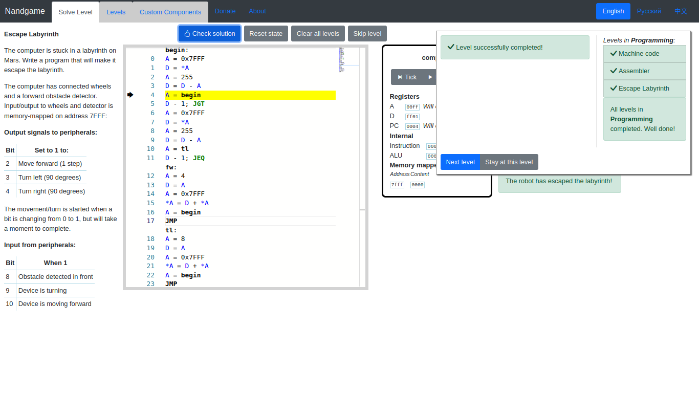

[↩ Return](README.md)
# Software
* [Low level](#low-level)
	+ [Machine code](#machine-code)
	+ [Assembler Language](#assembler-language)
	+ [Assembler program](#assembler-program)
	+ [Escape Labyrinth](#escape-labyrinth)
	+ [Display](#display)
	+ [Network](#network)
* [Stack machine](#stack-machine)
	+ [Init stack](#init-stack)
	+ [Push D](#push-d)
	+ [Pop D](#pop-d)
	+ [Pop A](#pop-a)
	+ [Push Value](#push-value)
	+ [Add](#add)
	+ [Sub](#sub)
	+ [Neg](#neg)
	+ ~~[And](#and)~~
	+ ~~[Or](#or)~~
* [High-level language](#high-level-language)
	+ [Tokenize](#tokenize)
	+ [Grammar](#grammar)
	+ [Code generation](#code-generation)
* [Conditionals](#conditionals)
	+ ~~[Eq](#eq)~~
	+ ~~[Gt](#gt)~~
	+ ~~[Lt](#lt)~~
	+ ~~[Not](#not)~~
	+ ~~[Goto](#goto)~~
	+ ~~[If-goto](#if-goto)~~
* [Memory](#memory)
	+ ~~[Push Memory](#push-memory)~~
	+ ~~[Pop Memory](#pop-memory)~~
	+ ~~[Push Static](#push-static)~~
	+ ~~[Pop Static](#pop-static)~~
* [Functions](#functions)
	+ ~~[Call](#call)~~
	+ ~~[Function](#function)~~
	+ ~~[Return](#return)~~
	+ ~~[Push argument](#push-argument)~~
	+ ~~[Pop argument](#pop-argument)~~
	+ ~~[Push local](#push-local)~~
	+ ~~[Pop local](#pop-local)~~

    # Low level

## Machine code
| ci |   |   | sm | zx | nx | zy | ny | f | no | a | d | \*a | lt | eq | gt |
|:--:|:-:|:-:|:--:|:--:|:--:|:--:|:--:|:-:|:--:|:-:|:-:|:---:|:--:|:--:|:--:|
| 1  | 0 | 0 | 0  | 1  | 0  | 1  | 0  | 1 | 0  | 0 | 1 | 0   | 0  | 0  | 0  |
| 0  | 0 | 0 | 0  | 0  | 0  | 0  | 0  | 0 | 0  | 0 | 0 | 0   | 0  | 1  | 0  |
| 1  | 0 | 0 | 0  | 0  | 1  | 1  | 1  | 1 | 1  | 0 | 1 | 0   | 0  | 0  | 0  |
| 1  | 0 | 0 | 0  | 0  | 0  | 0  | 0  | 0 | 0  | 0 | 0 | 0   | 1  | 1  | 1  |


## Assembler Language
```asm
# Assembler code 
loop:
A = 0x7FFF
*A = *A+1
*A = *A+1
A = loop
JMP
```
_~ not ready yet ~_

## Assembler program
```
pass
```
_~ not ready yet ~_

## Escape Labyrinth
```asm
begin:
A = 0x7FFF
D = *A
A = 255
D = D - A
A = begin
D - 1; JGT
A = 0x7FFF
D = *A
A = 255
D = D - A
A = tl
D - 1; JEQ
fw:
A = 4
D = A
A = 0x7FFF
*A = D + *A
A = begin
JMP
tl:
A = 8
D = A
A = 0x7FFF
*A = D + *A
A = begin
JMP
```


## Display
```asm
A = 0x4000
D = A
*A = D
A = A + 1
*A = D
A = 0x4200
*A = D
```

## Network
```
pass
```

# Stack machine

## Init stack
| Name | Number |
| :--: |:------:|
| SP   | 0      |
```asm
A = 0x0100
D = A
A = SP
*A = D
```

## Push D
```asm
A = SP
A = *A
*A = D
A = SP
*A = *A+1
```

## Pop D
```asm
A = SP
*A = *A-1
A = *A
D = *A
```

## Pop A
```asm
A = SP
*A = *A-1
A = *A
A = *A
```

## Push Value
```asm
A = value
D = A
PUSH_D
```

## Add
```asm
POP_D
POP_A
D = D + A
PUSH_D
```

## Sub
```asm
POP_D
POP_A
D = A - D
PUSH_D
```

## Neg
```asm
POP_A
D = -A
PUSH_D
```

## And
```asm
pass
```

## Or
```asm
pass
```
# High-level language

## Tokenize
| Type    | Match  | Grammar | Name   |
|:-------:|:------:|:-------:|:------:|
| Pattern | [ ]+   | Ignore  |        |
| Pattern | [0-9]+ | Name    | Number |
| Exact   | +      | Literal |        |
| Exact   | -      | Literal |        |
| Exact   | (      | Literal |        |
| Exact   | )      | Literal |        |

## Grammar
| Symbol     | Expression          |
|:----------:|:-------------------:|
| PROGRAM    | Expression          |
| Expression | Expression + Number |
| Expression | Number              |
| Expression | Expression - Number |
| Expression | ( Expression )      |
| Expression | Number - Expression |
| Expression | Number + Expression |
| Expression | - Expression        |

## Code generation
`PROGRAM` `Expression`
```asm

```

`Expression` `Expression + Number`
```asm
[Expression]
PUSH_VALUE [Number]
ADD
```

`Expression` `Number`
```asm
PUSH_VALUE [Number]
```

`Expression` `Expression - Number`
```asm
[Expression]
PUSH_VALUE [Number]
SUB
```

`Expression` `( Expression )`
```asm
[Expression]
```

`Expression` `Number - Expression`
```asm
PUSH_VALUE [Number]
[Expression]
SUB
```

`Expression` `Number + Expression`
```asm
PUSH_VALUE [Number]
[Expression]
ADD
```

`Expression` `- Expression`
```asm
[Expression]
NEG
```

# Conditionals

## Eq
_~ not ready yet ~_

## Gt
_~ not ready yet ~_

## Lt
_~ not ready yet ~_

## Not
_~ not ready yet ~_

## Goto
_~ not ready yet ~_

## If-goto
_~ not ready yet ~_

# Memory

## Push Memory
_~ not ready yet ~_

## Pop Memory
_~ not ready yet ~_

## Push Static
_~ not ready yet ~_

## Pop Static
_~ not ready yet ~_

# Functions
_~ not ready yet ~_

## Call
_~ not ready yet ~_

## Function
_~ not ready yet ~_

## Return
_~ not ready yet ~_

## Push argument
_~ not ready yet ~_

## Pop argument
_~ not ready yet ~_

## Push local
_~ not ready yet ~_

## Pop local
_~ not ready yet ~_

